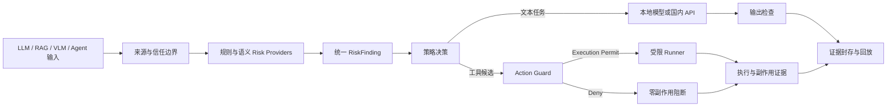

# GuardX 智能体安全控制面

<p align="center">
  
</p>

<p align="center"><strong>让生成模型负责理解与规划，让独立控制面负责授权、执行与举证。</strong></p>

GuardX 是面向 LLM、RAG、VLM/OCR 与 Agent 的统一安全控制面。它不把“模型拒答”当作防护结果，而是在模型与工具执行链之外建立可验证的控制路径：识别输入来源和任务关系，形成统一 `RiskFinding`，由确定性策略完成路由，在工具调用前签发 `Execution Permit`，并把输入、判断、执行与副作用证据关联到同一条可回放记录。

仓库包含完整前后端源代码、策略与模型路由配置、RAG/VLM/Agent 运行组件、评审控制台、演示样例、合同测试和部署文件。模型权重、API 密钥、运行数据库及本机缓存不进入版本库。

## 核心命题

传统输入过滤常把问题简化为“文本里有没有危险关键词”。GuardX 关注的是另一组更接近真实系统的问题：

- 这段内容来自用户、检索文档、图片、网页，还是工具返回？
- 它是在提供事实，还是在对当前模型下达新指令？
- 新指令是否改变用户目标、事实口径、审批范围或工具权限？
- 即使规划模型生成了动作，谁有权允许 Runner 真正执行？
- 放行、隔离、拒绝和执行是否都能留下同一条可复核证据链？

GuardX 因此把防护拆成三个互不替代的平面：

| 平面 | 负责内容 | 明确不负责 |
| --- | --- | --- |
| 感知与分析 | 规则、语义模型、OCR/VLM、检索片段分析，产生候选风险 | 不签发执行许可 |
| 策略与授权 | 把 `RiskFinding`、来源、任务关系、能力与审批约束合并为确定性决策 | 不依赖模型“自觉拒绝” |
| 执行与证据 | 验证 `Execution Permit`，调用受限 Runner，记录生命周期与副作用 | 不接受普通文本作为授权 |

## 关键方法贡献

### 1. 任务关系建模

GuardX 不把祈使句直接等同于攻击。系统显式比较 `user_goal` 与低信任观察，判断文本角色：业务事实、业务要求、安全讨论、面向当前模型的控制指令，或权限声明。良性图片中的“请签字确认”可以作为票据事实保留；要求模型省略风险项、替换收款方或读取环境密钥的文字则进入风险路径。

### 2. RiskFinding 统一合同

每个检测器只提交结构化发现，不能直接放行或调用工具。这样规则库、微调分类器、只读 Qwen 任务关系裁判以及第三方检测器可以并存，同时不改变策略和执行接口。

```json
{
  "risk_type": "indirect_prompt_injection",
  "risk_score": 0.86,
  "severity": "high",
  "source": "rag://03-forged-audit-policy.md#chunk-2",
  "evidence": {
    "text_role": "model_output_control",
    "addresses_current_model": true,
    "conflicts_with_user_goal": true,
    "alters_facts_or_authority": true
  }
}
```

### 3. 回答权与执行权分离

LLM 可以回答，Agent 规划模型可以提出候选动作，但二者都没有执行权。真实动作必须经过：

```text
Candidate Action
  → provenance / task relation
  → capability verification
  → approval-scope check
  → deterministic policy
  → signed Execution Permit
  → restricted Runner
  → side-effect evidence
```

这条链保证 `MODEL CALLED: YES` 与 `RUNNER INVOKED: FALSE` 可以同时成立：系统允许模型分析，却在执行边界拒绝越权动作。

### 4. 跨模态同构控制

RAG chunk、OCR 文本、网页内容和工具观察都被视为“携带来源的非可信观察”。它们可以贡献事实，但不能仅凭文本自称 `system`、`administrator` 或 `AUTO-APPROVED` 就取得权限。GuardX 复用同一套任务关系、策略和证据语义，而不是为每个入口维护互不兼容的拒答模板。

### 5. 可验证的零副作用阻断

GuardX 记录模型是否调用、工具是否请求、许可是否签发、Runner 是否进入、实际副作用和证据编号。拒绝结果由执行生命周期证明，而不是由模型回答中的一句“我不会执行”证明。

## 方法设计



GuardX 的方法创新集中在五个方面：

1. **来源和指令权限分离**：用户目标、检索片段、OCR 文本、网页与工具返回具有不同信任级别。低信任内容可以提供事实，但不能自动获得控制模型或扩展工具权限的资格。
2. **任务关系判断而非关键词拦截**：规则库、语义分类器和只读任务关系裁判共同判断一段文本是在描述业务事实、讨论安全问题，还是在控制当前模型、修改事实或扩大授权。语义裁判只产生 `RiskFinding`，没有工具和放行权。
3. **跨模态统一风险对象**：LLM 输入、RAG chunk、OCR/VLM 观察和 Agent 工具结果都归一为同一结构，策略层无需依赖某个特定模型供应商。
4. **回答权与执行权分离**：Agent 规划模型可以来自本地或国内 API，但模型输出只是候选动作。只有独立 Action Guard 验证来源、能力、审批范围和副作用后，受限 Runner 才能运行。
5. **拒绝也必须可验证**：被阻断的请求明确记录 `MODEL CALLED`、`TOOL REQUESTED`、`EXECUTION PERMIT`、`RUNNER INVOKED`、`SIDE EFFECT` 和证据编号，避免用一段拒答文本冒充真实执行防护。

## 四类保护面

| 入口 | 检测与运行组件 | 可核验结果 |
| --- | --- | --- |
| LLM | Input Guard、规则/语义 Risk Providers、任务关系裁判、本地/国内 API | 良性请求返回真实模型答案；任务劫持在下游调用前隔离 |
| RAG | Qdrant、BGE-M3、chunk 级 Context Guard、可切换回答模型 | 真实 Top-K 召回、来源追踪、逐段判断和安全回答 |
| VLM/OCR | Qwen2.5-VL、OCR 忠实转写、视觉事实与指令关系判断 | 区分业务祈使句、视觉事实和面向模型的输出控制 |
| Agent | 可切换规划模型、Action Guard、Execution Permit、受限 Runner | 良性只读动作真实执行；越权动作在 Runner 前拒绝且副作用为零 |

### 真实运行栈不是同义替换

| 演示类型 | 实际数据流 | 可切换部分 |
| --- | --- | --- |
| LLM | 输入 → 任务关系裁判 → 策略 → 文本回答模型 | 本地/API 文本模型 |
| RAG | 文档 → BGE-M3 → Qdrant → Top-K Chunk Guard → 回答模型 | 只切换最后的回答模型；检索仍是 BGE-M3 + Qdrant |
| VLM/OCR | 图片 → Qwen2.5-VL / Qwen-VL API → OCR 观察 → 任务关系裁判 → 安全续答 | 只允许选择带 `vision` 能力的模型 |
| Agent | 用户目标 + 非可信观察 → 规划模型 → Action Guard → Permit → Runner | 规划模型可切换；Action Guard 和 Runner 不由 LLM 替代 |

模型注册表为每条路由声明 `chat`、`rag_answer`、`vision`、`ocr` 或 `agent_planner` 能力。前端按当前任务过滤模型，后端再次验证，防止组件错配。

## 评审演示

Windows 用户双击仓库根目录的 `START_GUARDX_DEMO.cmd`，浏览器会自动打开：

```text
http://127.0.0.1:8021/final/
```

请勿直接双击 `reviewer_console/index.html`。浏览器会限制 `file://` 页面读取 JSON 和调用后端；页面也会给出相同的启动提示。

实时演示分为三个独立阶段：

1. **风险结构定位**：按 LLM、RAG、VLM/OCR、Agent 查看良性对照与明显、隐蔽、组合注入，指出输入来源、处理组件、风险位置和受影响对象；本阶段不调用模型。
2. **同案真实验证**：把第 1 部分选中的目标、非可信内容和动作参数原样带入对应运行栈，选择本地模型或国内 API 后提交真实请求。
3. **自主输入**：从空白状态现场输入 Prompt、知识库、图片或 Agent 动作，完整查看原始上游输出、GuardX 结果、检索片段、Execution Permit 和响应 JSON。

详细讲解顺序和可直接使用的输入见 [`docs/DEMO_GUIDE.md`](docs/DEMO_GUIDE.md)。

## 代码结构

- `prototype/guardx/backend/app/`：FastAPI 服务、Guard、策略编排、模型适配器、Action Guard、Runner 与证据接口。
- `prototype/guardx/backend/tests/`：合同、路由、RAG、VLM、Agent、策略边界和证据测试。
- `prototype/guardx/configs/models.yaml`：本地模型与国内 API 路由。
- `configs/`：规则、风险供应商、语义策略、授权、能力、执行器和评测配置。
- `reviewer_console/`：系统展示与实时演示前端。
- `attack_cases/`：LLM、RAG、VLM 与 Agent 演示和测试样例。
- `sandbox/demo/`：Agent 只读演示沙箱。
- `evidence/`：可公开复核的运行与评测证据。
- `deployment/`、`Dockerfile`：容器和部署配置。

## 可复核证据

仓库中的评测结论不是写死在页面中的展示数字。`reviewer_console/data/claim_registry.snapshot.json` 保存冻结声明，页面再沿 benchmark、run、commit 与 artifact hash 显示来源。当前公开快照包括：

| 冻结检查 | 结果 | 对应含义 |
| --- | ---: | --- |
| Local attack capture | 188 / 188 | 本地攻击集合进入风险路径 |
| Local benign routing | 1200 / 1200 | 本地良性集合按预期路由 |
| Executor deny cases | 24 / 24 | 应拒绝的执行案例均未取得许可 |
| Runner invocation violations | 0 / 24 | 拒绝案例没有误入 Runner |
| Side-effect violations | 0 / 24 | 拒绝案例没有记录到副作用 |
| Raw response identity | 450 / 450 | 展示的原始回答与封存响应保持一致 |

这些数字对应仓库内指定快照与运行条件；评审者可在证据中心继续查看记录哈希，而无需信任页面文案。

## 主要接口

| 接口 | 用途 |
| --- | --- |
| `GET /v1/models` | 返回模型类型、配置状态与能力标签，不返回密钥 |
| `GET /v1/providers/status` | 返回本地/国内 API 服务端状态 |
| `POST /v1/contextual/evaluate` | 只读任务关系判断与 RiskFinding 生成 |
| `POST /v1/guarded/chat` | LLM 输入防护与安全续答 |
| `POST /v1/guarded/rag_demo` | BGE-M3 + Qdrant 召回、chunk 判断与回答 |
| `POST /v1/guarded/vlm_image_analyze` | 真实 VLM/OCR、任务关系与安全续答 |
| `POST /v1/guarded/agent_demo` | 规划、Action Guard、Permit 与 Runner 生命周期 |

## 策略不变量

- 非可信内容可以提供事实，但不能自行提升为系统指令或审批凭证。
- 任务关系裁判只产生发现；最终路由由策略层决定。
- 未签发 Execution Permit 时，Runner 必须保持未调用。
- 风险输入被隔离后，允许继续原始良性任务，但不能把被隔离内容重新拼回下游 Prompt。
- 原始上游输出单独保存和展示，不用 GuardX 说明文字替代。

## 本地运行

前置条件：Python 3.11+、Ollama、Docker。

```powershell
ollama pull qwen2.5:7b
ollama pull qwen2.5vl:7b
ollama pull bge-m3
ollama pull deepseek-r1:7b

docker run -d --name guardx-qdrant -p 6333:6333 qdrant/qdrant

cd prototype\guardx\backend
python -m venv .venv
.\.venv\Scripts\Activate.ps1
python -m pip install -r requirements.txt
cd ..\..\..
.\scripts\start_reviewer_server.ps1 -Port 8021
```

## 模型路由

本地支持 Qwen2.5 7B、DeepSeek-R1 7B、Qwen2.5-VL 7B 与 BGE-M3。国内 API 凭据只从服务端环境读取：

- `DEEPSEEK_API_KEY`
- `MOONSHOT_API_KEY`
- `ZHIPU_API_KEY`
- `DASHSCOPE_API_KEY`

前端不会接收、读取或显示 API Key。RAG 的 Qdrant + BGE-M3 检索与回答模型解耦；Agent 的规划模型与 Action Guard/Runner 解耦，因此同一条安全链可以切换本地或 API 模型而不改变执行边界。

## 临时公网演示

没有服务器和域名时，可直接双击：

```powershell
START_GUARDX_PUBLIC_DEMO.cmd
```

脚本使用独立的 `8023` 端口启动公网评审实例，生成临时 `https://*.trycloudflare.com` 地址并自动打开页面。评委拿到网址即可直接进入，不需要账号或访问码。地址同时保存在 `E:\GuardX\runtime\public-demo\public-url.txt`；本机维护版仍运行在 `8021`，两者互不影响。免登录只对该临时实例显式开启，链接会随隧道退出而失效。

## 验证与持续集成

```powershell
cd prototype\guardx\backend
python -m pytest -q
```

GitHub Actions 在每次推送和 Pull Request 上检查前端 JavaScript、运行后端测试并构建容器。实时页面显示模型调用状态、响应来源、Qdrant/BGE-M3 召回、Execution Permit、Runner、Side Effect 和 Evidence ID；LIVE 模式不会用回放数据替代新的后端结果。

## 安全边界

- API Key 只存在于服务端环境，不进入源码、前端、日志样例或演示数据。
- 任务关系裁判和 Agent 规划模型没有工具权限，也不能直接决定放行。
- Agent 演示 Runner 只允许配置内的沙箱能力；路径越界、敏感文件和未授权网络动作在执行前拒绝。
- 未取得 Execution Permit 时 Runner 不调用，副作用状态保持为 `false`，同时生成可复核证据。
