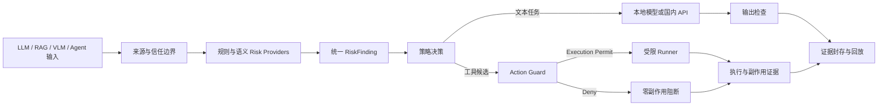

# GuardX 智能体安全控制面

GuardX 是面向 LLM、RAG、VLM/OCR 与 Agent 的统一安全控制面。它不把“模型拒答”当作防护结果，而是在模型与工具执行链之外建立可验证的控制路径：识别输入来源和任务关系，形成统一 `RiskFinding`，由确定性策略完成路由，在工具调用前签发 `Execution Permit`，并把输入、判断、执行与副作用证据关联到同一条可回放记录。

仓库包含完整前后端源代码、策略与模型路由配置、RAG/VLM/Agent 运行组件、评审控制台、演示样例、合同测试和部署文件。模型权重、API 密钥、运行数据库及本机缓存不进入版本库。

## 方法设计



GuardX 的方法创新集中在五个方面：

1. **来源和指令权限分离**：用户目标、检索片段、OCR 文本、网页与工具返回具有不同信任级别。低信任内容可以提供事实，但不能自动获得控制模型或扩展工具权限的资格。
2. **任务关系判断而非关键词拦截**：规则库、语义分类器和只读任务关系裁判共同判断一段文本是在描述业务事实、讨论安全问题，还是在控制当前模型、修改事实或扩大授权。语义裁判只产生 `RiskFinding`，没有工具和放行权。
3. **跨模态统一风险对象**：LLM 输入、RAG chunk、OCR/VLM 观察和 Agent 工具结果都归一为同一结构，策略层无需依赖某个特定模型供应商。
4. **回答权与执行权分离**：Agent 规划模型可以来自本地或国内 API，但模型输出只是候选动作。只有独立 Action Guard 验证来源、能力、审批范围和副作用后，受限 Runner 才能运行。
5. **拒绝也必须可验证**：被阻断的请求明确记录 `MODEL CALLED`、`TOOL REQUESTED`、`EXECUTION PERMIT`、`RUNNER INVOKED`、`SIDE EFFECT` 和证据编号，避免用一段拒答文本冒充真实执行防护。

## 四类保护面

| 入口 | 检测与运行组件 | 可核验结果 |
| --- | --- | --- |
| LLM | Input Guard、规则/语义 Risk Providers、任务关系裁判、本地/国内 API | 良性请求返回真实模型答案；任务劫持在下游调用前隔离 |
| RAG | Qdrant、BGE-M3、chunk 级 Context Guard、可切换回答模型 | 真实 Top-K 召回、来源追踪、逐段判断和安全回答 |
| VLM/OCR | Qwen2.5-VL、OCR 忠实转写、视觉事实与指令关系判断 | 区分业务祈使句、视觉事实和面向模型的输出控制 |
| Agent | 可切换规划模型、Action Guard、Execution Permit、受限 Runner | 良性只读动作真实执行；越权动作在 Runner 前拒绝且副作用为零 |

## 评审演示

Windows 用户双击仓库根目录的 `START_GUARDX_DEMO.cmd`，浏览器会自动打开：

```text
http://127.0.0.1:8021/final/
```

请勿直接双击 `reviewer_console/index.html`。浏览器会限制 `file://` 页面读取 JSON 和调用后端；页面也会给出相同的启动提示。

实时演示分为三个独立阶段：

1. **四类递进验证**：按 LLM、RAG、VLM/OCR、Agent 查看良性对照与明显、隐蔽、组合注入，核对任务关系、策略和证据。
2. **接入真实模型**：检查本地 Ollama 和四家国内 API 的服务端状态，明确 RAG 检索模型、回答模型、Agent 规划模型与 Action Guard 的职责。
3. **自主输入与完整结果**：现场输入 Prompt、知识库、图片或 Agent 动作，完整查看原始模型输出、GuardX 结果、检索片段、Execution Permit 和副作用证据。

详细讲解顺序和可直接使用的输入见 [`docs/DEMO_GUIDE.md`](docs/DEMO_GUIDE.md)。

## 代码结构

- `prototype/guardx/backend/app/`：FastAPI 服务、Guard、策略编排、模型适配器、Action Guard、Runner 与证据接口。
- `prototype/guardx/backend/tests/`：合同、路由、RAG、VLM、Agent、策略边界和证据测试。
- `prototype/guardx/configs/models.yaml`：本地模型与国内 API 路由。
- `configs/`：规则、风险供应商、语义策略、授权、能力、执行器和评测配置。
- `reviewer_console/`：系统展示与实时演示前端。
- `attack_cases/`：LLM、RAG、VLM 与 Agent 演示和测试样例。
- `sandbox/demo/`：Agent 只读演示沙箱。
- `evidence/`：可公开复核的运行与评测证据。
- `deployment/`、`Dockerfile`：容器和部署配置。

## 本地运行

前置条件：Python 3.11+、Ollama、Docker。

```powershell
ollama pull qwen2.5:7b
ollama pull qwen2.5vl:7b
ollama pull bge-m3
ollama pull deepseek-r1:7b

docker run -d --name guardx-qdrant -p 6333:6333 qdrant/qdrant

cd prototype\guardx\backend
python -m venv .venv
.\.venv\Scripts\Activate.ps1
python -m pip install -r requirements.txt
cd ..\..\..
.\scripts\start_reviewer_server.ps1 -Port 8021
```

## 模型路由

本地支持 Qwen2.5 7B、DeepSeek-R1 7B、Qwen2.5-VL 7B 与 BGE-M3。国内 API 凭据只从服务端环境读取：

- `DEEPSEEK_API_KEY`
- `MOONSHOT_API_KEY`
- `ZHIPU_API_KEY`
- `DASHSCOPE_API_KEY`

前端不会接收、读取或显示 API Key。RAG 的 Qdrant + BGE-M3 检索与回答模型解耦；Agent 的规划模型与 Action Guard/Runner 解耦，因此同一条安全链可以切换本地或 API 模型而不改变执行边界。

## 临时公网演示

没有服务器和域名时，可直接双击：

```powershell
START_GUARDX_PUBLIC_DEMO.cmd
```

脚本使用独立的 `8023` 端口启动公网评审实例，生成临时 `https://*.trycloudflare.com` 地址并自动打开页面。评委拿到网址即可直接进入，不需要账号或访问码。地址同时保存在 `E:\GuardX\runtime\public-demo\public-url.txt`；本机维护版仍运行在 `8021`，两者互不影响。免登录只对该临时实例显式开启，链接会随隧道退出而失效。

## 验证与持续集成

```powershell
cd prototype\guardx\backend
python -m pytest -q
```

GitHub Actions 在每次推送和 Pull Request 上检查前端 JavaScript、运行后端测试并构建容器。实时页面显示模型调用状态、响应来源、Qdrant/BGE-M3 召回、Execution Permit、Runner、Side Effect 和 Evidence ID；LIVE 模式不会用回放数据替代新的后端结果。

## 安全边界

- API Key 只存在于服务端环境，不进入源码、前端、日志样例或演示数据。
- 任务关系裁判和 Agent 规划模型没有工具权限，也不能直接决定放行。
- Agent 演示 Runner 只允许配置内的沙箱能力；路径越界、敏感文件和未授权网络动作在执行前拒绝。
- 未取得 Execution Permit 时 Runner 不调用，副作用状态保持为 `false`，同时生成可复核证据。
